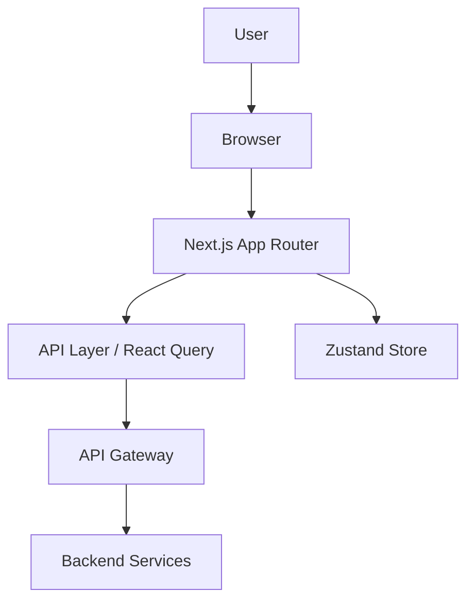
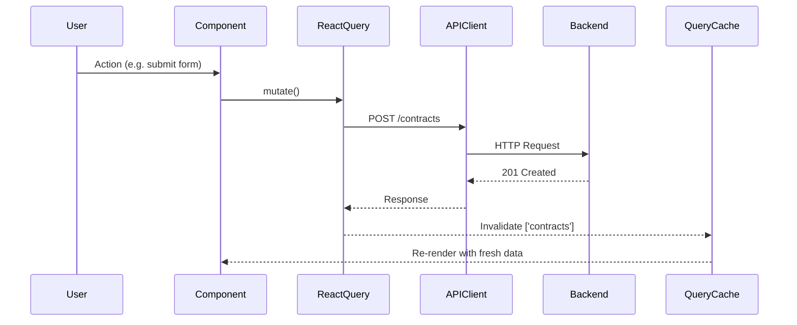
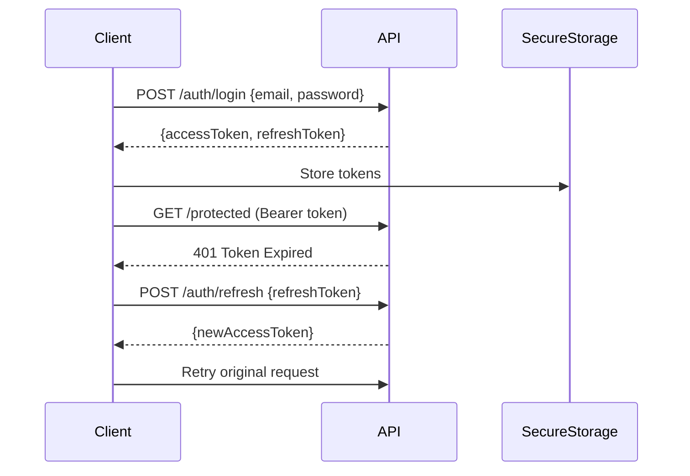

# SDD Client Skill

This skill produces **Client-Side Software Design Documents** — engineering-grade technical
specifications that serve as the implementation contract for frontend and mobile developers.

The output is not a UI spec. It is a **technical architecture document**: precise, implementable,
and free of visual design details.

---

## Pre-Generation Checklist

Before writing a single line of SDD, the agent must:

1. **Read reference documents** in the order defined in `RULE.md` (§2)
2. **Detect the client type**: Web SPA / SSR / Mobile Native / Cross-Platform / PWA
3. **Identify the tech stack** from PRD, BRD, or ask the user (§ Clarification Protocol)
4. **Check for existing SDD** in `.nitro/steering/sdd_client/*` to avoid duplication
5. **Check backend SDD** in `.nitro/steering/sdd/*` to inherit API contracts
6. **List open unknowns** before starting — do not silently assume

---

## Clarification Protocol

If any of the following are unknown, **ask before writing**:

```
- Target platform(s): Web / Android / iOS / React Native / Flutter / PWA
- Framework and version: Next.js 14? React 18? Flutter 3.x? Kotlin Compose?
- State management library (or "none — use component state")
- API authentication method: JWT / OAuth2 / Session cookie / API Key
- API documentation: OpenAPI spec, Swagger URL, or manual description
- Offline/local-first requirements
- Existing design system or component library
- SSR / SSG / CSR rendering preference
- Internationalization / RTL requirements
- Accessibility compliance level (WCAG 2.1 A / AA / AAA)
```

Use the question tool. Do NOT proceed with assumptions on platform-critical items.

---

## Document Sections — Full Specification

### SECTION 1 — Overview & Scope

```markdown
## 1. Overview

### 1.1 Document Purpose
What this SDD covers; which team(s) it serves; what it does NOT cover.

### 1.2 Client Type
Web SPA | Web SSR | PWA | Android Native | iOS Native | React Native | Flutter

### 1.3 Tech Stack
| Layer             | Technology         | Version |
|-------------------|--------------------|---------|
| Framework         | Next.js            | 14.x    |
| Language          | TypeScript         | 5.x     |
| State Management  | Zustand            | 4.x     |
| Server State      | TanStack Query     | 5.x     |
| Styling           | Tailwind CSS       | 3.x     |
| HTTP Client       | Axios              | 1.x     |
| Build Tool        | Vite / Turbopack   | -       |
| Testing           | Vitest + RTL       | -       |

### 1.4 Browser / Device Support
- Browsers: Chrome 120+, Firefox 120+, Safari 17+, Edge 120+
- Devices: Desktop, Tablet (768px+), Mobile (375px+)
- (For mobile: Android 10+ / iOS 16+)

### 1.5 Out of Scope
List explicitly what this SDD does not cover.
```

---

### SECTION 2 — Architecture

```markdown
## 2. Frontend Architecture

### 2.1 Rendering Strategy
- CSR (Client-Side Rendering)
- SSR (Server-Side Rendering)
- SSG (Static Site Generation)
- ISR (Incremental Static Regeneration)
- Hybrid (per-route decision)

Rationale: Why was this strategy chosen?

### 2.2 High-Level Architecture Diagram



### 2.3 Folder Structure

```
src/
├── app/                  # Next.js App Router pages
├── features/             # Feature-based modules
│   └── contracts/
│       ├── components/
│       ├── hooks/
│       ├── api/
│       └── store/
├── shared/
│   ├── components/       # Reusable UI primitives
│   ├── hooks/
│   ├── utils/
│   └── types/
├── lib/                  # Third-party config (axios, query client)
└── styles/
```

### 2.4 Module Boundaries
Define which features are isolated and which share state.
List explicit import rules (e.g., feature A cannot import from feature B directly).

### 2.5 Micro-Frontend Strategy (if applicable)
Shell app, remote apps, shared dependencies, communication protocol.
```

---

### SECTION 3 — Routing & Navigation

```markdown
## 3. Routing & Navigation

### 3.1 Route Map

| Route                        | Component / Page         | Auth Required | Role    |
|------------------------------|--------------------------|---------------|---------|
| /                            | LandingPage              | No            | Public  |
| /login                       | LoginPage                | No            | Public  |
| /dashboard                   | DashboardLayout          | Yes           | Any     |
| /dashboard/contracts         | ContractListPage         | Yes           | Admin   |
| /dashboard/contracts/:id     | ContractDetailPage       | Yes           | Admin   |
| /dashboard/contracts/new     | ContractFormPage         | Yes           | Admin   |

### 3.2 Auth Guard Strategy
Describe: redirect behavior for unauthenticated users, role-based rendering,
token validation on route entry.

### 3.3 Nested Layouts
Diagram or description of layout nesting (e.g., RootLayout → DashboardLayout → PageContent).

### 3.4 Navigation Components
- Sidebar: which routes, collapse behavior, active state
- Top Navbar: user menu, notifications, breadcrumb
- Bottom Navigation (mobile only): tabs and icons
```

---

### SECTION 4 — Component Architecture

```markdown
## 4. Component Architecture

### 4.1 Component Philosophy
- Atomic Design / Feature-based / Layered (choose one and explain)
- Smart vs. Dumb (Container vs. Presentational) separation policy

### 4.2 Component Hierarchy — Per Page / Feature

Example for Contract Module:
```
ContractListPage (smart — fetches data)
├── FilterBar (dumb — receives props)
│   ├── SearchInput
│   ├── StatusDropdown
│   └── DateRangePicker
├── ContractTable (smart — pagination state)
│   ├── TableHeader
│   ├── ContractRow (dumb)
│   └── Pagination
└── EmptyState (dumb)
```

### 4.3 Page Responsibility Matrix

| Page               | API Calls              | Global State Read | Global State Write | Loading State | Error State | Empty State |
|--------------------|------------------------|-------------------|--------------------|---------------|-------------|-------------|
| ContractListPage   | GET /contracts         | auth.user         | -                  | Yes           | Yes         | Yes         |
| ContractDetailPage | GET /contracts/:id     | auth.user         | -                  | Yes           | Yes         | No          |
| ContractFormPage   | POST/PUT /contracts    | -                 | -                  | Yes           | Yes         | No          |

### 4.4 Shared / Reusable Components

| Component     | Props Summary                        | Used In              |
|---------------|--------------------------------------|----------------------|
| Button        | variant, size, loading, disabled     | Global               |
| Modal         | isOpen, onClose, title, children     | Global               |
| DataTable     | columns, data, pagination, onSort    | List pages           |
| FormField     | label, error, children               | All forms            |
| StatusBadge   | status: enum                         | Contract, Invoice    |
```

---

### SECTION 5 — State Management

```markdown
## 5. State Management

### 5.1 Strategy Summary
- Global State: Zustand (user session, UI theme, notifications)
- Server State: TanStack Query (all API-fetched data)
- Local State: React useState/useReducer (form fields, toggle states)
- Form State: React Hook Form

### 5.2 Global Store Structure

```typescript
// Auth Store (Zustand)
interface AuthStore {
  user: User | null;
  token: string | null;
  isAuthenticated: boolean;
  login: (credentials: LoginPayload) => Promise<void>;
  logout: () => void;
  refreshToken: () => Promise<void>;
}

// UI Store (Zustand)
interface UIStore {
  sidebarCollapsed: boolean;
  theme: 'light' | 'dark';
  notifications: Notification[];
}
```

### 5.3 Server State (React Query / SWR) Policy

| Query Key              | Stale Time | Cache Time | Refetch on Focus |
|------------------------|-----------|------------|-----------------|
| ['contracts']          | 30s       | 5min       | Yes             |
| ['contracts', id]      | 60s       | 10min      | No              |
| ['user', 'profile']    | 5min      | 30min      | No              |

### 5.4 Optimistic Updates
List which mutations use optimistic updates and their rollback strategy.

### 5.5 Data Flow Diagram


```

---

### SECTION 6 — API Integration

```markdown
## 6. API Integration

### 6.1 Base Configuration

```typescript
// lib/axios.ts
const apiClient = axios.create({
  baseURL: process.env.NEXT_PUBLIC_API_URL,
  timeout: 10_000,
  headers: { 'Content-Type': 'application/json' },
});

// Request interceptor: attach JWT
// Response interceptor: handle 401 → refresh token flow
```

### 6.2 Endpoint Catalog

List ALL endpoints the client consumes. Get this from backend SDD or ask for API docs.

| Method | Endpoint              | Auth | Request Body          | Response              | Error Codes       |
|--------|-----------------------|------|-----------------------|-----------------------|-------------------|
| POST   | /auth/login           | No   | {email, password}     | {token, refreshToken} | 401, 422          |
| GET    | /contracts            | Yes  | query: page, filter   | {items[], pagination} | 401, 403          |
| GET    | /contracts/:id        | Yes  | -                     | Contract              | 401, 403, 404     |
| POST   | /contracts            | Yes  | ContractCreatePayload | Contract              | 401, 403, 422     |
| PUT    | /contracts/:id        | Yes  | ContractUpdatePayload | Contract              | 401, 403, 404     |
| DELETE | /contracts/:id        | Yes  | -                     | 204 No Content        | 401, 403, 404     |

> **If API docs are missing**: ask the user to provide OpenAPI spec, Postman collection,
> or a description of each endpoint before writing this section.

### 6.3 Authentication Flow



### 6.4 Token Storage Policy

| Platform     | Storage Method           | Rationale                              |
|--------------|--------------------------|----------------------------------------|
| Web          | HttpOnly Cookie          | XSS-safe; CSRF mitigation via SameSite |
| React Native | SecureStore (Expo)       | OS keychain-backed                     |
| Flutter      | flutter_secure_storage   | Keychain / Keystore                    |

### 6.5 WebSocket / Real-time (if applicable)
Connection strategy, reconnect policy, event schema.

### 6.6 Error Handling Strategy

```typescript
// Standardized API error shape (must match backend SDD)
interface APIError {
  code: string;       // e.g. "VALIDATION_ERROR"
  message: string;    // human-readable
  details?: Record<string, string[]>; // field-level errors
}
```

Client handling by error type:
- `401 Unauthorized` → clear token, redirect to /login
- `403 Forbidden` → show permission error toast
- `404 Not Found` → render NotFound component
- `422 Validation` → map field errors to form
- `5xx Server` → show generic error + retry option
- `Network Error` → show offline banner
```

---

### SECTION 7 — Security

```markdown
## 7. Security

### 7.1 Authentication & Authorization
- Token storage (see §6.4)
- Auto-logout on token expiry
- Role-based UI rendering (hide/disable — NOT replace server-side enforcement)

### 7.2 XSS Prevention
- Use framework-native rendering (React's JSX escaping, Vue templates)
- Never use `dangerouslySetInnerHTML` / `v-html` with user content
- Content Security Policy (CSP) headers configured at server/CDN level

### 7.3 CSRF Protection
- SameSite=Strict on auth cookies
- Origin validation on state-changing requests

### 7.4 Input Validation
- Client-side: schema validation (Zod / Yup) on all forms — for UX only
- Server-side validation is authoritative — never trust client

### 7.5 Sensitive Data Handling
- No PII/secrets in localStorage, URL params, or console logs
- Mask sensitive fields in UI (e.g., partial card numbers)
- Clear sensitive state on logout

### 7.6 Dependency Security
- Lock versions in package.json / pubspec.yaml
- Run `npm audit` / `flutter pub audit` in CI pipeline
```

---

### SECTION 8 — Performance Strategy

```markdown
## 8. Performance

### 8.1 Core Web Vitals Targets (Web)
| Metric | Target  |
|--------|---------|
| LCP    | < 2.5s  |
| FID/INP| < 100ms |
| CLS    | < 0.1   |
| TTI    | < 3.5s  |

### 8.2 Code Splitting & Lazy Loading
- Route-level code splitting (automatic in Next.js App Router)
- Heavy components lazy-loaded with React.lazy / dynamic()
- Third-party scripts loaded with `next/script` strategy="lazyOnload"

### 8.3 Data Fetching Optimization
- Pagination for all list views (cursor-based preferred for large datasets)
- Virtual scrolling (react-window / react-virtual) for lists > 100 items
- Debounce on search inputs (300ms)
- SWR / React Query cache prevents redundant requests

### 8.4 Image & Asset Optimization
- Use next/image or equivalent with automatic WebP conversion
- Lazy load below-fold images
- SVG sprites for icon sets

### 8.5 Bundle Optimization
- Tree-shaking enabled (ESM imports only)
- Analyze bundle with `next build --analyze` or `vite-bundle-visualizer`
- Target total JS bundle < 200KB (gzipped) for initial load

### 8.6 Mobile-Specific (React Native / Flutter)
- FlatList / ListView with getItemLayout for large lists
- Hermes engine enabled (React Native)
- Image caching strategy (fast-image / cached_network_image)
- Reduce JS bridge calls in hot paths
```

---

### SECTION 9 — Error Handling & Resilience

```markdown
## 9. Error Handling & Resilience

### 9.1 Error Boundary Strategy
- Global ErrorBoundary wrapping entire app (catch unhandled render errors)
- Feature-level boundaries for isolated module failures
- Fallback UI: generic error message + "Try Again" button

### 9.2 Toast / Notification System
| Event Type         | Notification Type | Duration |
|--------------------|-------------------|----------|
| Form saved         | Success toast     | 3s       |
| API error          | Error toast       | 5s       |
| Network offline    | Persistent banner | Until online |
| Validation error   | Inline field error| Until corrected |

### 9.3 Retry Strategy
- Automatic retry on network errors: 3 attempts, exponential backoff (1s, 2s, 4s)
- No auto-retry on 4xx errors (except 429 with Retry-After header)

### 9.4 Offline / Degraded Mode
Define which features work offline, which show a graceful fallback.
```

---

### SECTION 10 — Accessibility

```markdown
## 10. Accessibility

### 10.1 Compliance Target
WCAG 2.1 Level AA

### 10.2 Implementation Requirements
- All interactive elements keyboard-navigable (Tab, Enter, Space, Escape)
- Focus visible at all times (no outline:none without replacement)
- ARIA labels on icon-only buttons, form fields, and dynamic regions
- Color contrast ≥ 4.5:1 for normal text, ≥ 3:1 for large text
- No information conveyed by color alone
- Screen reader testing: VoiceOver (Safari/iOS), TalkBack (Android), NVDA (Windows)

### 10.3 i18n / RTL
- i18n library: next-intl / react-i18next / Flutter's intl
- RTL support: test layout flip for Arabic/Persian/Hebrew
- Date/number formatting: use Intl API, not hardcoded format strings
```

---

### SECTION 11 — Testing Strategy

```markdown
## 11. Testing Strategy

### 11.1 Test Coverage Map

| Layer          | Tool                        | What's Tested                        |
|----------------|-----------------------------|--------------------------------------|
| Unit           | Vitest / Jest               | Utilities, hooks, store actions       |
| Component      | React Testing Library       | Component render, interactions        |
| Integration    | Vitest + MSW                | API integration with mocked server    |
| E2E            | Playwright / Cypress        | Critical user flows                   |
| Accessibility  | axe-core / Playwright       | WCAG violations                       |
| Visual         | Storybook + Chromatic       | Component regression (optional)       |

### 11.2 Critical E2E Flows to Cover
- User registration and login
- [List 3–7 key user journeys from user_flow_map]

### 11.3 Code Quality Toolchain
- ESLint (+ typescript-eslint, react-hooks plugin)
- Prettier
- Husky pre-commit hooks
- Type coverage ≥ 90% (TypeScript strict mode)
```

---

### SECTION 12 — Deployment & Environment

```markdown
## 12. Deployment

### 12.1 Environment Strategy

| Environment | URL                  | API Backend          | Notes               |
|-------------|----------------------|----------------------|---------------------|
| Local       | localhost:3000       | localhost:8000       | .env.local          |
| Staging     | staging.example.com  | api-staging.example  | .env.staging        |
| Production  | app.example.com      | api.example.com      | .env.production     |

### 12.2 CI/CD Pipeline
1. On PR: lint, type-check, unit tests, component tests
2. On merge to main: build + E2E tests + deploy to staging
3. On release tag: deploy to production

### 12.3 Environment Variables
List all required env vars (names only, never values).
```
NEXT_PUBLIC_API_URL=
NEXT_PUBLIC_SENTRY_DSN=
NEXT_PUBLIC_GA_MEASUREMENT_ID=
```

### 12.4 Feature Flags (if applicable)
Library, flag naming convention, fallback behavior.
```

---

### SECTION 13 — Monitoring & Observability

```markdown
## 13. Monitoring

### 13.1 Error Tracking
- Sentry: capture unhandled errors, API failures, performance spans
- Attach user context (id only, no PII) to error reports

### 13.2 Analytics
- Tool: [Google Analytics 4 / Mixpanel / PostHog]
- Event taxonomy: [link to analytics spec or define inline]

### 13.3 Core Web Vitals Monitoring
- Real User Monitoring (RUM) via Vercel Analytics / Datadog RUM / custom

### 13.4 Session Recording (optional)
If used, document PII masking configuration.
```

---

### SECTION 14 — Open Questions & Decisions Log

```markdown
## 14. Open Questions

> This file is ALWAYS maintained. Never leave it empty during active development.

| ID  | Question                                      | Owner    | Status  | Resolution |
|-----|-----------------------------------------------|----------|---------|------------|
| OQ1 | Which refresh token rotation strategy?        | Backend  | Open    | -          |
| OQ2 | Offline support scope for mobile app?         | Product  | Open    | -          |
| OQ3 | Max file upload size for contract attachments?| Backend  | Resolved| 10MB       |

## Architectural Decisions Log (ADR-lite)

| ID  | Decision                              | Rationale                         | Date       |
|-----|---------------------------------------|-----------------------------------|------------|
| D1  | Use TanStack Query over Redux Toolkit | Simpler server-state management   | 2024-01-15 |
| D2  | Zustand over Context API              | Performance, devtools, simplicity | 2024-01-15 |
```

---

## Quality Gates Before Finalizing

Before handing off any SDD section, verify all items in this checklist:

- [ ] Tech stack versions are pinned
- [ ] Every route has auth guard status defined
- [ ] Every page has: API calls, states (loading/error/empty), component tree
- [ ] All API endpoints are documented with schema (or flagged as pending)
- [ ] Token storage decision is documented and justified per platform
- [ ] Security section addresses XSS, CSRF, input validation
- [ ] Performance targets are set (Core Web Vitals or mobile equivalents)
- [ ] Test coverage map is defined
- [ ] `open_questions.md` exists and is populated
- [ ] No design-system concerns (colors, fonts) are in the SDD

---

## Common Pitfalls to Avoid

| Mistake | Correct Approach |
|---|---|
| Writing pixel-level UI specs | Link to Figma; define component props/behavior only |
| Assuming API structure | Always ask for or read the backend SDD / OpenAPI spec |
| Mixing global and local state | Explicitly categorize each piece of state |
| Skipping empty/error states | Every page must define all UI states |
| Token storage in localStorage | Use HttpOnly cookies (web) or SecureStore (mobile) |
| Single monolithic SDD file | Split by section for large projects |
| Copy-pasting backend SDD API list | Verify client actually consumes each endpoint |

---